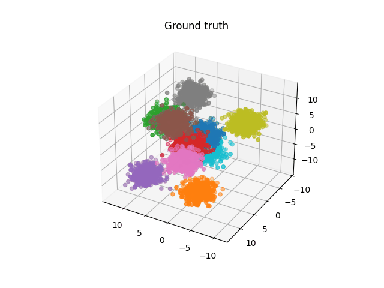
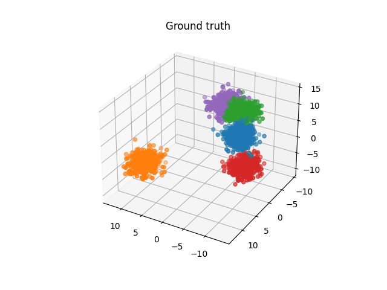

# Clustering test

### Results using k means

##### K = 7 with 500 samples of 10 ground truth clusters *(500 * 10 = 5000)* datapoints in 3 dimensions

##### K = 5 with 500 samples per class but in *3 dimensions*

##### K = 20

##### K = 7

